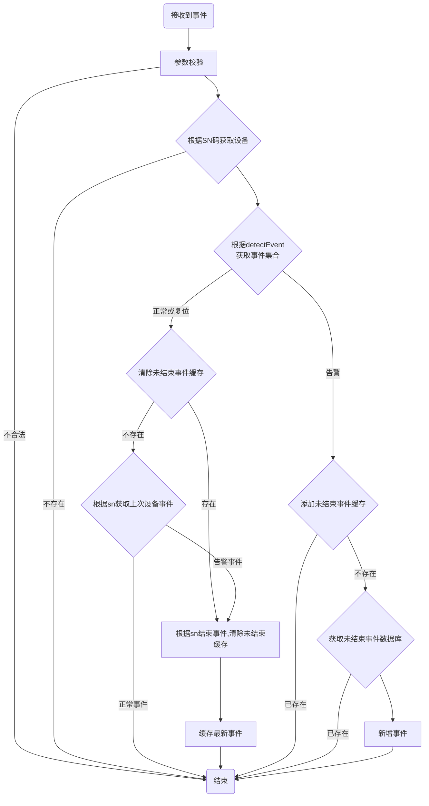

# 事件上传流程

```mermaid
graph TD
START(接收到事件) --> 参数校验
参数校验 --> |不合法|END
参数校验 --> 获取设备{根据SN码获取设备}
获取设备 --> |不存在|END
获取设备 --> 获取事件{根据detectEvent<br>获取事件集合}
获取事件 --> |正常或复位|清除未结束{清除未结束事件缓存}
清除未结束 --> |存在|结束[根据sn结束事件,清除未结束缓存]
清除未结束 --> |不存在|获取最新事件{根据sn获取上次设备事件}
获取最新事件 --> |正常事件|END
获取最新事件 --> |告警事件|结束
结束 --> 缓存最新事件[缓存最新事件] --> END
获取事件 --> |告警|添加未结束事件缓存{添加未结束事件缓存}
添加未结束事件缓存 --> |已存在|END
添加未结束事件缓存 --> |不存在|获取未结束事件数据库{获取未结束事件数据库}
获取未结束事件数据库 --> |已存在|END
获取未结束事件数据库 --> 新增事件[新增事件] --> END
END(结束)
```

